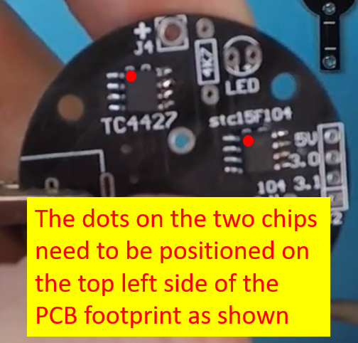
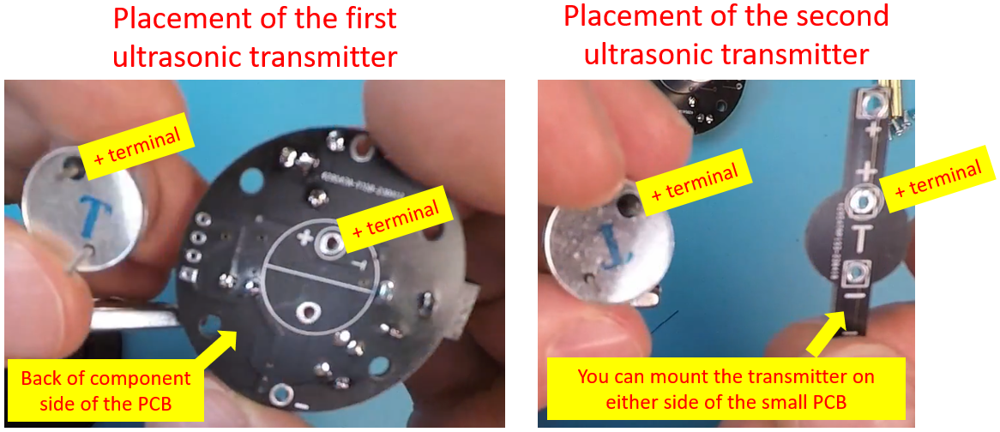

# Project: Ultrasonic levitation

# ID:23110
---
This project is about defying gravity using sound waves alone. It is hard to believe that such thing is possible until you see it with your own eyes!

One great thing about this kit is it comes with excellent documentation that describes every step of the build ! **[Here is the link to the technical guide][1]**.

We have also included the translated version of the single page in Chinese that comes with the kit. **[You can access that leaflet using this link][2]**

Following is the link to the product page in case you would like to get the levitation kit yourself to build. It will keep you engaged and you will be inspired to try different experiments with it onve it is built.

**[Click here to buy the ultrasonic levitation kit][3]**

If you build this project, please share your thoughts and suggestions with the rest of circuitapps community in the comments section of **[our YouTube video][4]**. Also, please feel free to talk about any interesting modifications you make and your experimentations, if any !

## Project Challenges
There are a few things to be careful with while building this project to make sure you get it working after the first attempt

### **Caution 1 - Correct placement of the two 8-pin chips**

Make sure you locate the small dot on each of the 8-pin chips first and place them correctly as indicated below. Failure to get this correct will cause problems.

### **Caution 2 - Polarity of the two ultrasonic transmitters**

It is critically important to get the positioning and the polarity of the two transmitters. The one that goes on the circular PCB has to be mounted on the opposite side of the components as shown below. The transmitter that goes on the smaller short PCB can be mounted on either side as long as you get the polarity correct as shown below.

## Useful tips

One suggestion we have for you is to patiently assemble this PCB and solder each component with great care. It is a simple assembly but watch out for the polarity of certain components as well as which side of the PCB they need to be mounted on. Please have a quick read of ***[this technical guide][1]*** before you start the assembly to get familiar with various steps of the build process.

## ACKNOWLEDGEMENT

We would like to send our kudos to the manufacturer of this kit ICStation, who has provided an excellent customer support when the first kit we procured did not work. ICStation was quick to respond to our request for help and supplied us with a second kit for free, which was used to create our **[YouTube content][4]**. Thank you ***[ICStation][5]*** !

[1]: ./levitation_23110_guide.pdf
[2]: ./levitation_23110_translation.jpg
[3]: https://amzn.to/3JIJeC6
[4]: https://youtu.be/DOA9MuhMeZE
[5]: https://www.amazon.com/stores/Icstation-IS/page/E74BE936-7A72-4647-8DE4-B7DF84302F87?ref_=ast_bln
